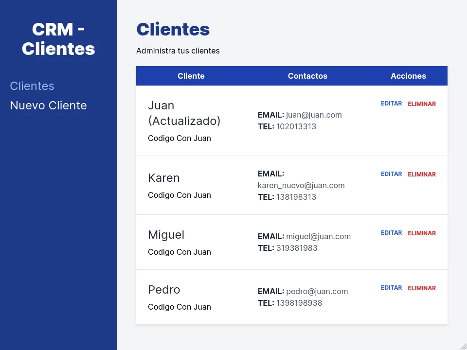

# Proyecto: Administrador de Clientes

Proyecto N° 4 del curso [React - La Guía Completa: Hooks Context Redux MERN +15 Apps](https://www.udemy.com/course/react-de-principiante-a-experto-creando-mas-de-10-aplicaciones/) de la plataforma Udemy dictado por [Juan Pablo De la torre Valdez](https://www.udemy.com/user/juanpablodelatorrevaldez/).

# Tecnologías utilizadas
Tecnología|Web oficial
-|-
React JS|[https://reactjs.org/](https://reactjs.org/)
Vite|[https://vitejs.dev/](https://vitejs.dev/)
Tailwind CSS|[https://tailwindcss.com/](https://tailwindcss.com/)
React Router DOM|[https://reactrouter.com/en/main](https://reactrouter.com/en/main)
JSON Server|[https://www.npmjs.com/package/json-server](https://www.npmjs.com/package/json-server)

## Instalación

```bash
$ npm install
```
## Ejecutando API

```bash
# instalar JSON Server
$ npm install -g json-server
# ejecutar servicio
$ json-server --watch db.json
```
## Ejecutando la aplicación

```bash
# development
$ npm run dev
```

## Crea la aplicación

```bash
# build
$ npm run build
```
